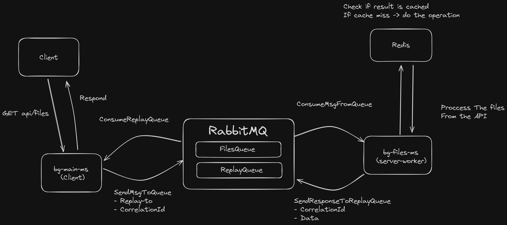

## How to Run
The application uses a microservice architecture so the easiest way to run it is by using docker-compose:  
In the root directory run the command:
   

     docker-compose run --build
If however, you want to run this project manually, here are some of the dependencies you need to have installed locally:

 - RabbitMQ
 - Redis
 - Typescript

You will need to run RabbitMQ and Redis locally and then run every microservice separately using the command:

    npm install
    npm run start:dev
    
    or
    
    npm install
    npm run build
    npm run start
All the microservices have the **.env.example** file showing how the configuration looks like.
## How to Test
Hit the endpoint route on the bs-main-ms (localhost:3000): `/api/files`

## Project Architecture

#### The idea behind this approach
Separate the load between two microservices:

 - **bs-main-ms**:
	 - The main server responsible for responding to the client
	 - Sending messages to the queue
 - **bs-files-ms**:
	 - The worker server responsible for processing the api response
	 - And for sending the replay back to the main server

The **RPC (request-replay) pattern** was used for communication between microservices with RabbitMQ.  
Reference to RPC: [RabbitMQ-RPC-Docs](https://www.rabbitmq.com/tutorials/tutorial-six-javascript)

This separation of logic has been done for easier scaling of costly operations like processing a large data set from the API response. We can easily later **horizontally scale** our files worker server, adding more instances for handling large amount of request using the **RabbitMQ**, introducing **exchanges and queues for evenly balancing our workers' loads**.   
This also offloads the heavy operations from our main server.

**Radis** server is there for the server-side cashing of the processing results. The expiration time has been set for easier testing purposes to **30 seconds**.

This architecture allows smooth integration of other microservices in the future, allowing the creation of new exchanges and queues, new worker services, etc.

## Server Structure

 - Custom middleware handles:
	 - Non existent routes
	 - Error handling
	 - Logger
	 - CORS (can be done with a package)
 - Config file for loading environmental variables
 - Setup scripts:
	 - npm run start
	 - npm run start:dev
	 - npm run build
	 - npm run test
 - Testing using Jest
	 - basic test with coverage showcase (no other test written)

